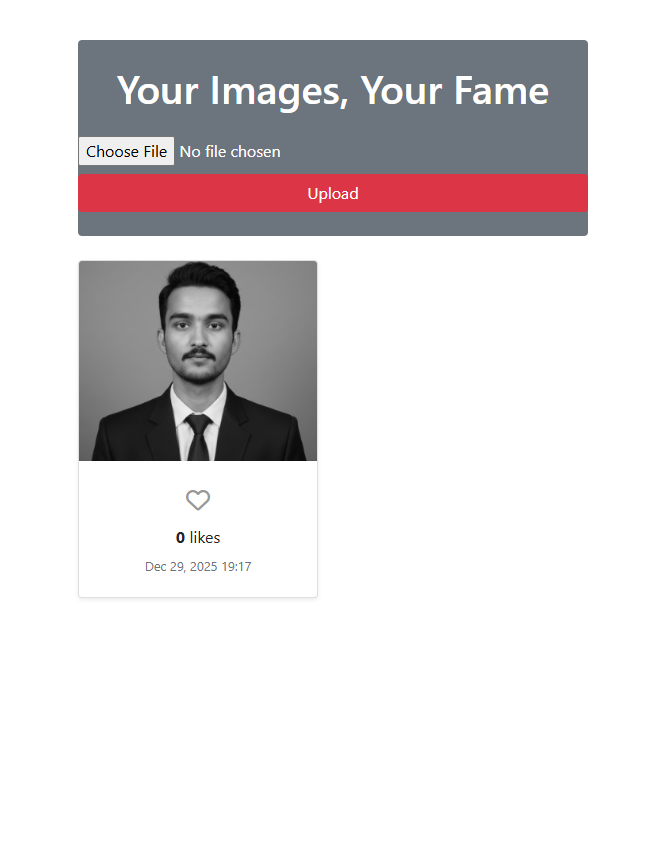

# Your Photo Your Fame Django 🖼️

A simple and modern **Django-based web app** to upload, view, like and manage images online.

---

## 👨‍💻 About This Project

- 🌱 **Built with Django and Bootstrap 4** for a clean and responsive UI.  
- 💻 Users can **upload images**, view them in a gallery, and see the upload date.  
- 🛠 Fully integrated **Admin panel** for managing uploaded images.  
- 🚀 Designed for learning **file uploads, media handling, and deployment on PythonAnywhere**.  

---

## 🖼 Demo Preview

<br>

---

## 🚀 Features

* Upload images easily with drag-and-click or file selection. 
* Gallery view of all uploaded images with upload date.  
* Fully responsive UI for desktop and mobile.  
* Admin panel for managing images and users.
* allows visitors to like the photos. 
* Simple, clean, and modern design.  

---

## 📂 Folder Structure
```
your-photo-your-fame-django/
│
├── myapp/
│ ├── migrations/
│ ├── static/
│ ├── templates/
│ │ └── myapp/
│ │ └── home.html
│ ├── admin.py
│ ├── apps.py
│ ├── forms.py
│ ├── models.py
│ ├── views.py
│ └── urls.py
│
├── imageuploader/
│ ├── settings.py
│ ├── urls.py
│ ├── wsgi.py
│ └── asgi.py
│
├── media/
├── db.sqlite3
├── manage.py
└── README.md
```

---

## 🛠 Technologies Used


---

## ⚡ Installation & Setup

1. **Clone the repository**

```bash
git clone https://github.com/dineshsinghdhami/image-uploader-django.git
cd image-uploader-django

```

---


2. Create a virtual environment
   
```bash
python -m venv venv
source venv/bin/activate   # Linux/Mac
venv\Scripts\activate      # Windows

```

---

3. Install dependencies

```bash
pip install -r requirements.txt

```

---


4. Apply migrations

```bash
python manage.py migrate

```

---

5. Run the development server

```bash
python manage.py runserver

Open http://127.0.0.1:8000 in your browser.

```

---

6. 🔑 Admin Panel

```bash

Create a superuser

python manage.py createsuperuser

```

7. Access admin panel
   
```bash
http://127.0.0.1:8000/admin

Manage uploaded images and users from the dashboard.

```

---

---


## 🌟 Connect with Me

Feel free to reach out via email or LinkedIn for collaboration or feedback!
* **Phone:** +977-9866109958
* **Email:** [dineshdhamidn@gmail.com](mailto:dineshdhamidn@gmail.com)
* **Twitter:** [https://x.com/dineshdhami001](https://x.com/dineshdhami001)
* **GitHub:** [github.com/dineshsinghdhami](https://github.com/dineshsinghdhami)
* **LinkedIn:** [linkedin.com/in/dineshsinghdhami1](https://linkedin.com/in/dineshsinghdhami1)


---

### 🧑‍💼 Project Owner  
- **Dinesh Singh Dhami ❤️**  
